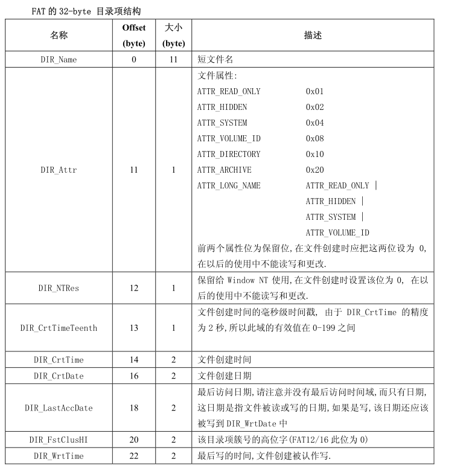
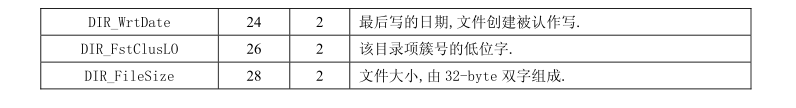
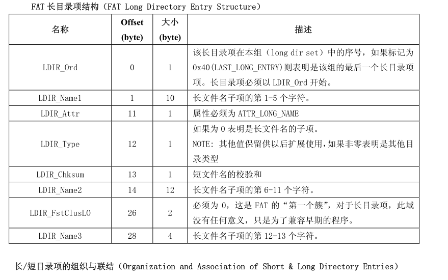

# Fat32实现

## 短目录项

此处特别注释目录项的第一个字节(DIR_NAME[0]).

- 如果 DIR_Name[0] == 0xE5, 则此目录为空(目录项不包含文件和目录),表示曾经被使用过
-  如果 DIR_Name[0] == 0x00, 则此目录为空(同 0xE5),并且此后的不再分配有目录项(此后所有的DIR_Name[0]均为 0).不同于 0xE5,如果 DIR_Name[0]的值为 0，那么 FAT 程序将不会再去检测其后续的磁盘空间，因为这些空间都是空闲的。
- 如果 DIR_Name[0] == 0x05,则文件名在该位的实际值为 0xE5,0xE5 是日文中合法的字符,当需要用0xE5 来作为 DIR_Name[0]时使用 0x05 来代替，避免程序误认为该目录项为空。
- DIR_Name 域实际由两部分组成：8 个字符的主文件名和 3 个字符的扩展名。两部分如果字符数不够的
  话由空格(0x20)填充
- ==DIR_Name[0]不允许为 0x20,主文件名和扩展名之间的间隔 ‘.’并不真实的存在于 DIR_Name 中，小
  写字母不允许出现在 DIR_Name 中(这些字符因不同的国家和地区而已).==

## 长目录项

- 0x00~0x00：1 个字节，长文件名目录项的序列号，一个文件的第一个长文件名序列号为 1，然后依次递增。如果是该文件的最后一个长文件名目录项，==则将该目录项的序号与 0x40 进行“或（OR）运算”的结果写入该位置。如果该长文件名目录项对应的文件或子目录被删除，则将该字节设置成删除标志 0xE5==
- 0x01~0x0A：5 个字节，长文件名的第 1~5 个字符。长文件名使用 Unicode 码，每个字符需要两个字节的空间。如果文件名结束但还有未使用的字节，则会在文件名后先填充两个字节的“00”，然后开始使用 0xFF 填充。
- 0x0B~0x0B：1 个字节，长目录项的属性标志，一定是 0x0F。
- 0x0C~0x0C：保留。
- 0x0D~0x0D：1 个字节，校验和。如果一个文件的长文件名需要几个长文件名目录项进行存储，则这些长文件名目录项具有相同的校验和。
- 0x0E~0x19：12 个字节，文件名的第 6~11 个字符，未使用的字节用 0xFF 填充。
- 0x1A~0x1B：2 个字节，保留。

- 0x1C~0x1F：4 个字节，文件名的第 12~13 个字符，未使用的字节用 0xFF 填充。

## 设计草案

## 缓存替换算法

[lru - crates.io: Rust Package Registry](https://crates.io/crates/lru)

## 参考资料

[Paul's 8051 Code Library: Understanding the FAT32 Filesystem (pjrc.com)](https://www.pjrc.com/tech/8051/ide/fat32.html)

[Implementing the FAT32 file system with Rust - SoByte](https://www.sobyte.net/post/2022-01/rust-fat32/)

[FAT - OSDev Wiki](https://wiki.osdev.org/FAT32)

[FAT32学习笔记1---FAT32格式初体验 - jasonactions - 博客园 (cnblogs.com)](https://www.cnblogs.com/smartjourneys/articles/8430375.html)

[详解FAT32文件系统 - CharyGao - 博客园 (cnblogs.com)](https://www.cnblogs.com/Chary/p/12981056.html)
