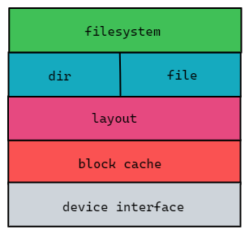

# Fat32实现

## Fat32文件系统格式


|   分区   | 功能                                                         |
| :------: | :----------------------------------------------------------- |
| 引导分区 | 作为保留扇区的一部分，也叫做DBR扇区，其包含了文件系统的大部分元信息，如每扇区字节数，每簇扇区数等 |
| 保留分区 | 除了引导分区外，保留分区中还包含一个`FSINFO`分区,用以记录文件系统中空闲簇的数量以及下一可用簇的簇号等信息，以供操作系统作为参考 |
|  FAT表   | 描述簇的分配状态以及标明文件或目录的下一簇的簇号             |
|  数据区  | 数据区起始位置为根目录，剩余空间由空闲簇构成                 |

具体的信息可以查看提供的手册文件。


### 短目录项


此处特别注释目录项的第一个字节(DIR_NAME[0]).

- 如果 DIR_Name[0] == 0xE5, 则此目录为空(目录项不包含文件和目录),表示曾经被使用过
-  如果 DIR_Name[0] == 0x00, 则此目录为空(同 0xE5),并且此后的不再分配有目录项(此后所有的DIR_Name[0]均为 0).不同于 0xE5,如果 DIR_Name[0]的值为 0，那么 FAT 程序将不会再去检测其后续的磁盘空间，因为这些空间都是空闲的。
- 如果 DIR_Name[0] == 0x05,则文件名在该位的实际值为 0xE5,0xE5 是日文中合法的字符,当需要用0xE5 来作为 DIR_Name[0]时使用 0x05 来代替，避免程序误认为该目录项为空。
- DIR_Name 域实际由两部分组成：8 个字符的主文件名和 3 个字符的扩展名。两部分如果字符数不够的
  话由空格(0x20)填充
- ==DIR_Name[0]不允许为 0x20,主文件名和扩展名之间的间隔 ‘.’并不真实的存在于 DIR_Name 中，小
  写字母不允许出现在 DIR_Name 中(这些字符因不同的国家和地区而已).==

### 长目录项


- 0x00~0x00：1 个字节，长文件名目录项的序列号，一个文件的第一个长文件名序列号为 1，然后依次递增。如果是该文件的最后一个长文件名目录项，==则将该目录项的序号与 0x40 进行“或（OR）运算”的结果写入该位置。如果该长文件名目录项对应的文件或子目录被删除，则将该字节设置成删除标志 0xE5==
- 0x01~0x0A：5 个字节，长文件名的第 1~5 个字符。长文件名使用 Unicode 码，每个字符需要两个字节的空间。如果文件名结束但还有未使用的字节，则会在文件名后先填充两个字节的“00”，然后开始使用 0xFF 填充。
- 0x0B~0x0B：1 个字节，长目录项的属性标志，一定是 0x0F。
- 0x0C~0x0C：保留。
- 0x0D~0x0D：1 个字节，校验和。如果一个文件的长文件名需要几个长文件名目录项进行存储，则这些长文件名目录项具有相同的校验和。
- 0x0E~0x19：12 个字节，文件名的第 6~11 个字符，未使用的字节用 0xFF 填充。
- 0x1A~0x1B：2 个字节，保留。

- 0x1C~0x1F：4 个字节，文件名的第 12~13 个字符，未使用的字节用 0xFF 填充。


## 数据结构设计

针对手册提供的FAT32文件系统布局，设计一个合适的数据结构。



各层完成的功能如下:

- `device interface`: 一个块设备接口，定义了块设备应该实现的功能
- `block cache`：缓存层，为了更快地读写而添加，由于直接读写磁盘数据会很慢，将磁盘数据按照扇区号读取到内存中再对其进行操作可以达到更快的速度。
- `layout`：这一层主要是对FAT32磁盘布局的一个抽象，本项目中虽然定义了`DBR` 、`BPB`、·`FSINFO`等数据结构，但在后期的改进中这些结构并没有被使用，因为这些数据结构包含了许多冗余信息，在上层的实现中不需要，因此对这些信息进行了整合形成了`MetaData`，只需要使用这个整合的信息，就可以计算磁盘上的任何数据结构所在位置。
- `dir/file` : 这一层定义了`Dir`和`File`数据结构，这两个抽象构成了磁盘上的目录树，同时这两个数据机构位于内存当中，通过运行时加载的方式完成目录的构建，同时这一层也为这两个抽象定义了相应的接口。用户通过这些接口可以访问文件或者文件夹的内容。
- `filesystem`： 这一层主要是对`root dir`的一个包装，其完成文件系统的初始化工作，包括管理块设备接口，初始化缓存管理器并读取根目录。


## 接口设计

为了尽可能简化设计，项目中只为三个必要的数据结构定义了接口。这三个数据结构是上述提到的`MetaData` 、`Dir`、`File`。 

定义的接口如下:

```rust
pub trait Bpb {
    /// fat1/fat2的起始扇区
    fn fat_start_sector(&self) -> usize;
    /// 根目录的起始扇区
    fn root_dir_start_sector(&self) -> usize;
    /// 根据数据区的簇号得到数据区的起始扇区
    fn cluster_to_sector(&self, cluster: u32) -> usize;
    /// fat占用的扇区数
    fn sectors_per_fat_32(&self) -> usize;
    /// 数据区可用的簇数量
    fn free_cluster_count(&self) -> u32;
    /// 每簇大小
    fn bytes_per_cluster(&self) -> u32;
}
```

```rust
pub trait DirectoryLike {
    type Error;
    /// 本目录下创建一个子目录
    fn create_dir(&self, name: &str) -> Result<(), Self::Error>;
    /// 本目录下创建一个文件
    fn create_file(&self, name: &str) -> Result<(), Self::Error>;
    /// 删除本目录下一个子目录
    fn delete_dir(&self, name: &str) -> Result<(), Self::Error>;
    /// 删除本目录下的一个文件
    fn delete_file(&self, name: &str) -> Result<(), Self::Error>;
    /// 进入到某一个子目录
    fn cd(&self, name: &str) -> Result<Arc<Dir>, Self::Error>;
    /// 打开一个文件
    fn open(&self, name: &str) -> Result<Arc<File>, Self::Error>;
    /// 返回本目录下的文件和目录名称
    fn list(&self) -> Result<Vec<String>, Self::Error>;
    /// 重命名一个文件
    fn rename_file(&self, old_name: &str, new_name: &str) -> Result<(), Self::Error>;
    /// 重命名一个子目录
    fn rename_dir(&self, old_name: &str, new_name: &str) -> Result<(), Self::Error>;
}
```

```rust
pub trait FileLike {
    type Error;
    /// 读取偏移量为offset，大小为size的数据
    fn read(&self, offset: u32, size: u32) -> Result<Vec<u8>, Self::Error>;
    /// 在偏移量为offset处写入数据data
    fn write(&self, offset: u32, data: &[u8]) -> Result<u32, Self::Error>;
    /// 清空文件内容
    fn clear(&self);
}
```

## 注意事项

`Dir`与`File`提供并发读写的控制，由结构体中的读写锁保证，因此在实现的过程中需要注意函数调用是否会造成死锁。

## 参考资料

[Paul's 8051 Code Library: Understanding the FAT32 Filesystem (pjrc.com)](https://www.pjrc.com/tech/8051/ide/fat32.html)

[Implementing the FAT32 file system with Rust - SoByte](https://www.sobyte.net/post/2022-01/rust-fat32/)

[FAT - OSDev Wiki](https://wiki.osdev.org/FAT32)

[FAT32学习笔记1---FAT32格式初体验 - jasonactions - 博客园 (cnblogs.com)](https://www.cnblogs.com/smartjourneys/articles/8430375.html)

[详解FAT32文件系统 - CharyGao - 博客园 (cnblogs.com)](https://www.cnblogs.com/Chary/p/12981056.html)

[(77条消息) 【FatFs】FAT32文件系统协议总结（理论+实践）_ZHONGCAI0901的博客-CSDN博客_fat32协议](https://blog.csdn.net/ZHONGCAI0901/article/details/115196445)

[lru - crates.io: Rust Package Registry](https://crates.io/crates/lru)
